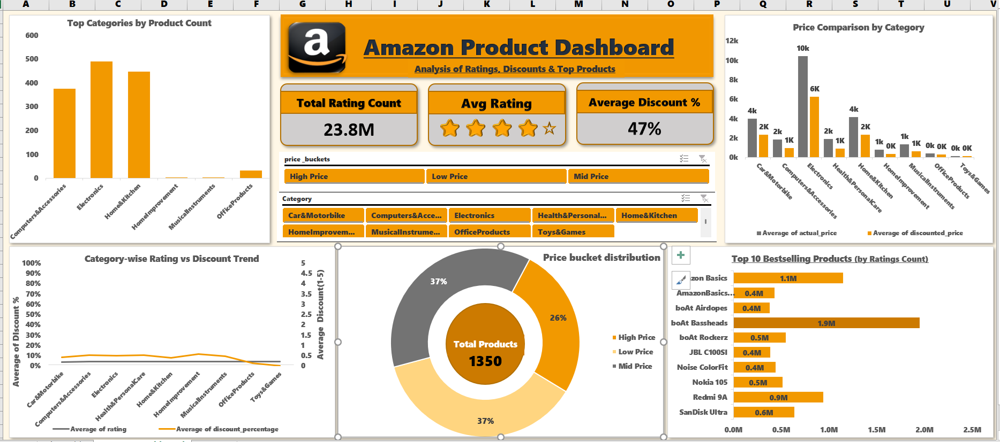

# 📊 Amazon Product Dashboard

An interactive **Excel Dashboard** built on Amazon product dataset, showcasing insights about pricing, discounts, ratings, and bestselling products.

## 🔹 Features
- ✅ KPI Cards → Total Products, Average Discount, Average Rating  
- ✅ Category-wise Sales & Discounts Analysis  
- ✅ Top 10 Bestselling Products  
- ✅ Rating vs Discount Correlation (Dual Axis Chart)  
- ✅ Price Distribution (Donut / Bar Chart)  
- ✅ Interactive Slicers for Category, Price Range, and Rating  

---

## 📂 Project File  
- 📘 (https://1drv.ms/x/c/e5f7de6562c0cb5f/EVlRMS2uj2BIs3nkjc15maEB7E4EufuPbgtoKe8sBO9YCA?e=w0z5u4)   

---

## 🖼️ Dashboard Preview
Here’s a quick look at the dashboard:

---

## 🛠️ Tools & Techniques
- Microsoft Excel 2019  
- Power Query (for Data Cleaning)  
- Pivot Tables & Charts    
- Interactive Slicers  

---

## 🚀 How to Use
1. Download the `Amazon_Dashboard.xlsx` file.  
2. Open in **Excel 2016+ / Office 365 / Excel 2019**.  
3. Use slicers to explore category-wise and discount-wise insights.  

---

## 📌 Author
Created by **[Mssingh]** ✨  
